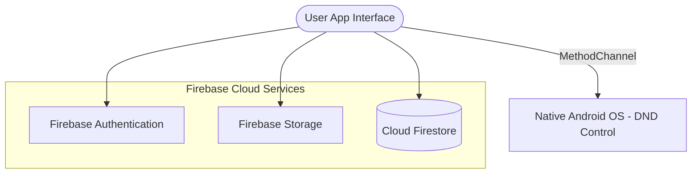

# Study Buddy - Productivity & Wellness Companion for Students

Study Buddy is a comprehensive cross-platform mobile application developed using **Flutter (Dart)** and backed by **Firebase (Auth, Firestore, Storage)**. It is designed to assist engineering college students in enhancing their study habits, time management, and collaborative learning while maintaining a balanced, healthy lifestyle.


## 🌟 Core Features

### 1. Gamified Progress & Virtual Tree Growth
*   **Virtual Tree Growth System:** Gamifies study sessions by tracking user study minutes and growing a virtual tree. The tree grows through 5 distinct levels (from Seedling to a fully grown tree bearing fruit) based on total focus minutes.
*   **Progress Dashboard:** Displays beautiful charts (powered by `fl_chart`) showcasing weekly study sessions and total minutes.
*   *Key Code:* [progress.dart](file:///e:/Projects/STUDY%20BUDDY%20-%20MINI%20PROJECT/study_buddy/lib/screens/progress.dart)

### 2. Pomodoro Focus Timer with Native DND Blocking
*   **Pomodoro Timer:** Fixed intervals of focus time (default: 25 mins) followed by short breaks (5 mins) and long breaks (15 mins) to maximize cognitive stamina.
*   **Distraction Blocking:** Integrates a native Android **MethodChannel** (`dnd_channel`) to automatically enable **Do Not Disturb (DND)** mode when focus sessions start, ensuring deep concentration.
*   *Key Code:* [focus_timer.dart](file:///e:/Projects/STUDY%20BUDDY%20-%20MINI%20PROJECT/study_buddy/lib/screens/focus_timer.dart)

### 3. Syllabus & Academic Resources Selection
*   **Resource Navigator:** Enables students to select their Semester (S1–S8) and Branch (Mechanical, Civil, IT, CSE, Electronics, Electrical).
*   **Resource Categories:** Seamlessly retrieves and organizes **Syllabus**, **Previous Question Papers**, and **Important Topics** fetched from Firestore.
*   *Key Code:* [syllabus.dart](file:///e:/Projects/STUDY%20BUDDY%20-%20MINI%20PROJECT/study_buddy/lib/screens/syllabus.dart)

### 4. Shared Lecture Notes & Documents Hub
*   **Notes Upload/Search:** Searchable platform allowing students to filter resources (All Notes, PDFs, PPTs), download files, or upload their own note files.
*   **Firebase Integration:** Uploads lecture notes and presentation files to Firebase Storage while listing document metadata in Firestore. Includes live upload progress indicators.
*   *Key Code:* [notes.dart](file:///e:/Projects/STUDY%20BUDDY%20-%20MINI%20PROJECT/study_buddy/lib/screens/notes.dart)

### 5. Health & Bedtime Tracker
*   **Sleep Schedule Manager:** Tracks bedtime, wakeup time, alarm state, and logs daily sleep durations. Visualizes weekly sleep patterns and consistency.
*   **Water & Exercise Logger:** Promotes physical wellness by tracking water intake (in glasses) and exercise duration (in minutes).
*   **Mood Tracker:** Encourages mental self-reflection by letting users check-in daily with 5 distinct mood levels (😄 Very Happy, 🙂 Happy, 😐 Neutral, 🙁 Sad, 😢 Very Sad).
*   *Key Code:* [bedtime_tracker.dart](file:///e:/Projects/STUDY%20BUDDY%20-%20MINI%20PROJECT/study_buddy/lib/screens/bedtime_tracker.dart) & [health.dart](file:///e:/Projects/STUDY%20BUDDY%20-%20MINI%20PROJECT/study_buddy/lib/screens/health.dart)

### 6. Real-Time Branch Group Chats
*   **Collaborative Forums:** Branch and semester-restricted group chatrooms (e.g., `CS_sem1`) for discussions, doubt clearing, and peer learning.
*   **Dynamic Groups:** Students can switch between different sem/branch channels.
*   *Key Code:* [group_chat_screen.dart](file:///e:/Projects/STUDY%20BUDDY%20-%20MINI%20PROJECT/study_buddy/lib/screens/group_chat_screen.dart)

### 7. Task Management & Personal Calendar
*   **To-Do List:** Integrated task creation tool with deadline calendar dates and completed checkboxes.
*   **Personal Calendar:** TableCalendar interface synchronizing personal events and tasks.
*   *Key Code:* [todo_screen.dart](file:///e:/Projects/STUDY%20BUDDY%20-%20MINI%20PROJECT/study_buddy/lib/screens/todo_screen.dart) & [personal_calendar.dart](file:///e:/Projects/STUDY%20BUDDY%20-%20MINI%20PROJECT/study_buddy/lib/screens/personal_calendar.dart)

---

## 🛠️ Technology Stack & Architecture



*   **Frontend Framework:** Flutter SDK (>= 3.7.0)
*   **Programming Language:** Dart
*   **Database:** Cloud Firestore (Real-time NoSQL)
*   **Authentication:** Firebase Auth
*   **Storage:** Firebase Storage (for profile pictures and PDF/PPT notes)
*   **Package Dependencies:** See [pubspec.yaml](file:///e:/Projects/STUDY%20BUDDY%20-%20MINI%20PROJECT/study_buddy/pubspec.yaml)

---

## 📂 Repository Directory Structure

```text
STUDY BUDDY - MINI PROJECT/               # Root project folder
│
├── study_buddy/                          # Core Flutter Application Code
│   ├── android/                          # Native Android platform code (includes DND MethodChannel logic)
│   ├── ios/                              # Native iOS platform code
│   ├── assets/                           # Image assets (e.g. app logo)
│   ├── test/                             # Unit & widget test suites
│   ├── pubspec.yaml                      # Project dependencies & configurations
│   └── lib/
│       ├── main.dart                     # App initialization (runs Splash screen -> AuthCheck)
│       ├── firebase_options.dart         # FlutterFire generated options config
│       ├── widgets/                      # Reusable UI elements (Buttons, TextFields)
│       └── screens/                      # Screen UI & Logic
│           ├── auth_check.dart           # User Auth router (Home Screen / Login Screen)
│           ├── bedtime_tracker.dart      # Bedtime logger & weekly sleep charts
│           ├── focus_timer.dart          # Focus mode timer & DND native method controller
│           ├── group_chat_screen.dart    # Classmate discussion forums by sem/branch
│           ├── health.dart               # Water, exercise, & mood tracker
│           ├── home_screen.dart          # Main application dashboard (quotes, quick metrics)
│           ├── login_screen.dart         # Account login UI with Firestore data validation
│           ├── notes.dart                # Shared digital library (notes PDF/PPT explorer)
│           ├── personal_calendar.dart    # Calendar views and personal event schedule list
│           ├── profile_completion_screen # Profile configuration screen (Name, branch, goal)
│           ├── progress.dart             # Virtual tree growth & study focus metrics
│           ├── signup_screen.dart        # Account sign-up UI
│           ├── splash_screen.dart        # Opening animated loading sequence
│           ├── syllabus.dart             # Course Syllabi & Previous Question Papers
│           ├── thoughts_journal.dart     # Private thought diary logger
│           └── todo_screen.dart          # Task lists and checkboxes
│
├── Study Buddy Report(Group 8).pdf       # Official B.Tech Mini Project Report
├── project PPT.pptx                      # Project defense presentation slides
└── [Diagram Assets]                      # Visual assets & flow diagrams
    ├── er.jpg                            # Entity Relationship Diagram (Database Schema)
    ├── use case.png                      # System Use Case Diagram
    ├── sequential.png                    # Interaction Sequence Diagram
    └── lvl0.jpg - lvl3.jpg               # Data Flow Diagrams (Level 0, Level 1, Level 2, Level 3)
```

---

## 🗄️ Firestore Database Schema

The Firebase Firestore schema utilizes the following collections:

| Collection Name | Document ID | Description / Fields |
| :--- | :--- | :--- |
| `users` | `userId` | User profile (name, bio, branch, age, academicGoal, profilePicUrl). |
| `todo` | Auto-generated | Tasks (title, dueDate, isDone, userId). |
| `journal_entries` | Auto-generated | Journal logs (title, content, date, userId). |
| `syllabus` | Auto-generated | Course resource links (branch, semester, subject, syllabusUrl, questionPapersList). |
| `study_sessions` | Auto-generated | Logged Pomodoro focus minutes (userId, timestamp, totalMinutes). |
| `calendar_events` | Auto-generated | Calendar schedule items (title, time, date, userId). |
| `notes` | Auto-generated | Notes shared in digital library (title, description, fileUrl, fileType, uploadedBy, uploadDate). |
| `health` | `${userId}-${yyyy-MM-dd}` | Health items (water, exercise, mood). |
| `group_chats` | `${branch}_sem${semester}` | Sub-collection `messages`: Chat message records (senderId, senderName, message, timestamp). |
| `users/{userId}/sleepData` | `settings` | User bedtime targets. Sub-collection `days`: Sleep logs (date, duration, qualityRating). |

---

## 🚀 Setup & Local Execution Instructions

### Prerequisites
*   [Flutter SDK](https://docs.flutter.dev/get-started/install) installed.
*   Android Studio / Xcode installed for emulator configurations.
*   Firebase project created via the [Firebase Console](https://console.firebase.google.com/).

### Installation Steps

1.  **Clone this Repository** to your local machine.
2.  Navigate to the core Flutter application directory:
    ```bash
    cd study_buddy
    ```
3.  **Fetch Flutter Dependencies:**
    ```bash
    flutter pub get
    ```
4.  **Connect to Firebase:**
    Ensure you have your Firestore database and Firebase Storage instances set up on your Firebase Console. Configure your platform specific credentials using the [FlutterFire CLI](https://firebase.google.com/docs/flutter/setup) to update the `firebase_options.dart` configuration.
5.  **Run the Application:**
    Start your target Android emulator, iOS simulator, or connect a physical device, and run:
    ```bash
    flutter run
    ```


## 📈 Future Scope & Extensions
*   **AI Study recommendations:** Providing customized study plans based on focus session habits.
*   **Wearable Integration:** Syncing sleep trackers and physical step counts directly with the Health module.
*   **Gamified Rewards:** Leaderboards to compare tree heights and study stats with group mates.
*   **Integrations:** Automatic synchronization with online LMS (Learning Management Systems).
